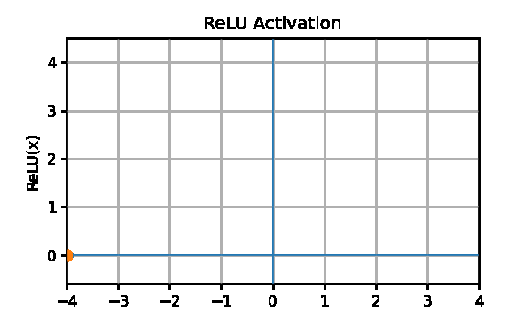

# Juan Diego Mendoza Torres

<table>
  <tr>
    <td width="50%" align="center">
      
    </td>

    <td width="50%" align="center">
      
    </td>
  </tr>
</table>

## 👨‍💻 About Me

> **Junior AI Engineer** focused on applied AI, Retrieval-Augmented Generation (RAG), and data pipelines.

I enjoy building practical, data-driven solutions with **Python**, **machine learning**, and modern AI tooling.

### 🚀 Selected AI Projects

- **NASA Stellar Analysis Pipeline**  
  Developed a data pipeline using NASA-related datasets to analyze stellar data and support high-accuracy classification and analysis.

- **Plant Health RAG System**  
  Built an end-to-end RAG application for plant-health assessment, including:
  - pest identification
  - infestation estimation
  - plant damage analysis
  - treatment recommendations designed to minimize harm to the plant

### 🎯 Current Focus

- Retrieval-Augmented Generation
- Applied Machine Learning
- Data Engineering
- AI Automation
- End-to-End AI Systems

## ⚙️ Technical Skills

  
    Current technical stack and hands-on experience across AI, data, and development tools.
  

| Technology | Proficiency | Practical Experience |
|:---|:---:|:---|
| 🐍 **Python** | **Intermediate** | Data processing, automation, AI pipelines, API integration, and RAG development |
| 🗄️ **SQL** | **Intermediate** | Queries, joins, filtering, aggregation, and structured data analysis |
| 🔧 **Git & GitHub** | **Intermediate** | Version control, repositories, branching, commits, remote workflows, and project documentation |
| 🧠 **RAG Systems** | **Beginner / Practical Experience** | Built two end-to-end RAG projects involving document retrieval, contextual generation, and domain-specific question answering |

