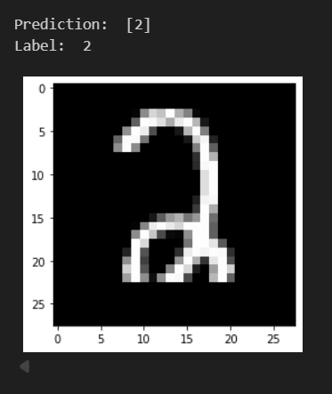

# Juan Diego Mendoza Torres

  

## 👨‍💻 About Me

> **Junior AI Engineer** focused on applied AI, Retrieval-Augmented Generation (RAG), and data pipelines.

I enjoy building practical, data-driven solutions with **Python**, **machine learning**, and modern AI tooling.

### 🚀 Selected AI Projects

- **NASA Stellar Analysis Pipeline**  
  Developed a data pipeline using NASA-related datasets to analyze stellar data and support high-accuracy classification and analysis.

- **Plant Health RAG System**  
  Built an end-to-end RAG application for plant-health assessment, including:
  - pest identification
  - infestation estimation
  - plant damage analysis
  - treatment recommendations designed to minimize harm to the plant

### 🎯 Current Focus

- Retrieval-Augmented Generation
- Applied Machine Learning
- Data Engineering
- AI Automation
- End-to-End AI Systems

| Technologies | Proficiency |
|---|---|
| Python | Intermediate |
| SQL | Intermediate |
| Git & GitHub | Intermediate |
| RAG | low |

## 🛠️ Technologies

### 💻 Programming & Data

  
  

---

### ☁️ Cloud & Development

  
  
  

